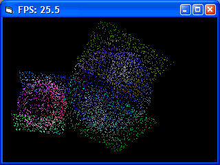



## Optimized Rotation \(update 7\)

### Description

Applying the Euler transform to four axis points .. the object points are projected vectorially. Update = lots of comments + diagram
 
### More Info
 

             |
---                |---
**Submitted On**   |2006-10-09 04:28:04
**By**             |[dafhi](https://github.com/Planet-Source-Code/PSCIndex/blob/master/ByAuthor/dafhi.md)
**Level**          |Intermediate
**User Rating**    |4.8 (43 globes from 9 users)
**Compatibility**  |VB 6\.0
**Category**       |[Graphics](https://github.com/Planet-Source-Code/PSCIndex/blob/master/ByCategory/graphics__1-46.md)
**World**          |[Visual Basic](https://github.com/Planet-Source-Code/PSCIndex/blob/master/ByWorld/visual-basic.md)
**Archive File**   |[Optimized\_2024021092006\.zip](https://github.com/Planet-Source-Code/dafhi-optimized-rotation-update-7__1-66453/archive/master.zip)

